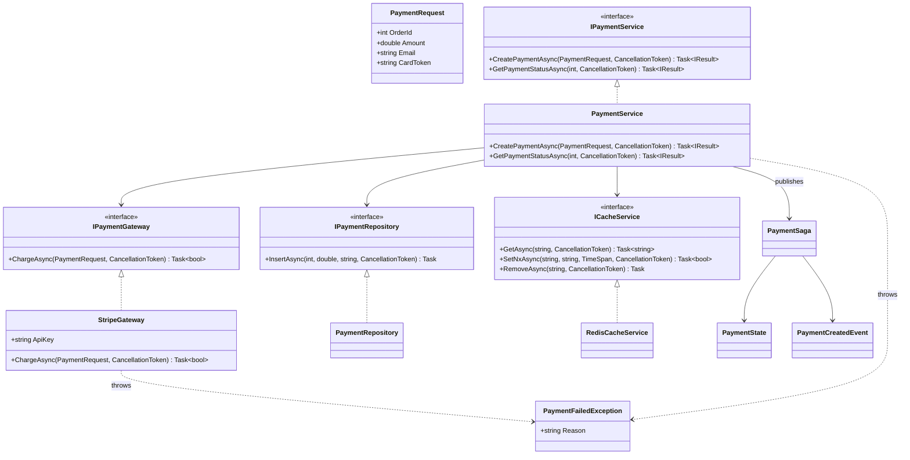
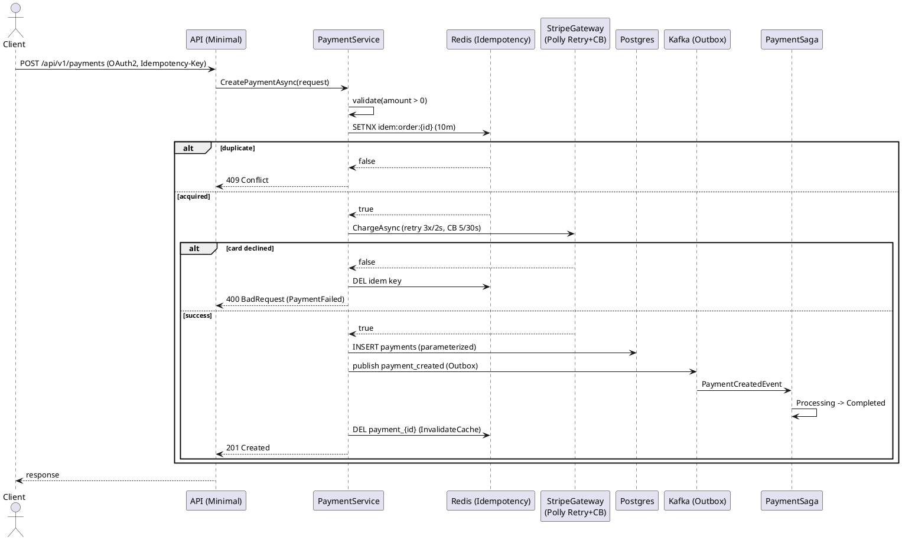

```mermaid
classDiagram
    class PaymentRequest {
        +int OrderId
        +double Amount
        +string Email
        +string CardToken
    }
    class PaymentFailedException {
        +string Reason
    }
    class IPaymentGateway {
        <<interface>>
        +ChargeAsync(PaymentRequest, CancellationToken) Task~bool~
    }
    class StripeGateway {
        +string ApiKey
        +ChargeAsync(PaymentRequest, CancellationToken) Task~bool~
    }
    class IPaymentService {
        <<interface>>
        +CreatePaymentAsync(PaymentRequest, CancellationToken) Task~IResult~
        +GetPaymentStatusAsync(int, CancellationToken) Task~IResult~
    }
    class PaymentService {
        +CreatePaymentAsync(PaymentRequest, CancellationToken) Task~IResult~
        +GetPaymentStatusAsync(int, CancellationToken) Task~IResult~
    }
    class IPaymentRepository {
        <<interface>>
        +InsertAsync(int, double, string, CancellationToken) Task
    }
    class PaymentRepository
    class ICacheService {
        <<interface>>
        +GetAsync(string, CancellationToken) Task~string~
        +SetNxAsync(string, string, TimeSpan, CancellationToken) Task~bool~
        +RemoveAsync(string, CancellationToken) Task
    }
    class RedisCacheService
    class PaymentSaga
    class PaymentState
    class PaymentCreatedEvent

    IPaymentGateway <|.. StripeGateway
    IPaymentService <|.. PaymentService
    IPaymentRepository <|.. PaymentRepository
    ICacheService <|.. RedisCacheService
    PaymentService --> IPaymentGateway
    PaymentService --> IPaymentRepository
    PaymentService --> ICacheService
    PaymentService --> PaymentSaga : publishes
    PaymentSaga --> PaymentState
    PaymentSaga --> PaymentCreatedEvent
    StripeGateway ..> PaymentFailedException : throws
    PaymentService ..> PaymentFailedException : throws
```

```plantuml
@startuml
actor Client
participant "API (Minimal)" as API
participant "PaymentService" as SVC
participant "Redis (Idempotency)" as REDIS
participant "StripeGateway\n(Polly Retry+CB)" as GW
participant "Postgres" as DB
participant "Kafka (Outbox)" as KAFKA
participant "PaymentSaga" as SAGA

Client -> API : POST /api/v1/payments (OAuth2, Idempotency-Key)
API -> SVC : CreatePaymentAsync(request)
SVC -> SVC : validate(amount > 0)
SVC -> REDIS : SETNX idem:order:{id} (10m)
alt duplicate
  REDIS --> SVC : false
  SVC --> API : 409 Conflict
else acquired
  REDIS --> SVC : true
  SVC -> GW : ChargeAsync (retry 3x/2s, CB 5/30s)
  alt card declined
    GW --> SVC : false
    SVC -> REDIS : DEL idem key
    SVC --> API : 400 BadRequest (PaymentFailed)
  else success
    GW --> SVC : true
    SVC -> DB : INSERT payments (parameterized)
    SVC -> KAFKA : publish payment_created (Outbox)
    KAFKA -> SAGA : PaymentCreatedEvent
    SAGA -> SAGA : Processing -> Completed
    SVC -> REDIS : DEL payment_{id} (InvalidateCache)
    SVC --> API : 201 Created
  end
end
API --> Client : response
@enduml
```